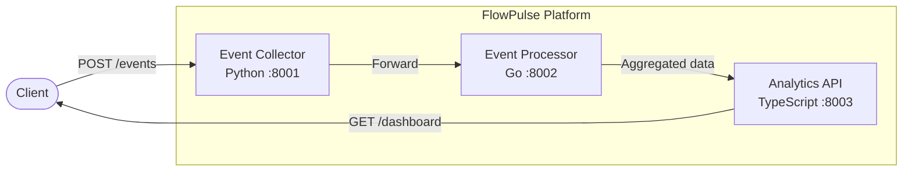

# FlowPulse Platform

Real-time event processing and analytics platform built with a polyglot microservices architecture using Python, Go, and TypeScript.

## Architecture



### Services

| Service | Language | Port | Description |
|---------|----------|------|-------------|
| **Event Collector** | Python 3.12 | 8001 | Ingests raw events via REST API, validates and stores them |
| **Event Processor** | Go 1.22 | 8002 | Processes events, classifies priority, generates tags |
| **Analytics API** | TypeScript (Node 20) | 8003 | Provides analytics recording and dashboard summaries |

## Quick Start

### Prerequisites

- Docker & Docker Compose
- Or: Python 3.12+, Go 1.22+, Node.js 20+

### Using Docker Compose

```bash
cp .env.example .env
make up
```

### Running Locally

```bash
# Event Collector (Python)
cd services/event-collector
pip install -r requirements.txt
python app.py

# Event Processor (Go)
cd services/event-processor
go run .

# Analytics API (TypeScript)
cd services/analytics-api
npm install
npm run dev
```

## API Reference

### Event Collector (port 8001)

#### Health Check
```
GET /health
```
```json
{"status": "healthy", "service": "event-collector", "timestamp": 1713600000.0}
```

#### Collect Event
```
POST /events
Content-Type: application/json

{"type": "click", "data": {"page": "/home", "user_id": "u123"}}
```
```json
{"id": 1, "status": "collected"}
```

#### List Events
```
GET /events
```
```json
{"events": [...], "count": 10}
```

### Event Processor (port 8002)

#### Health Check
```
GET /health
```

#### Process Event
```
POST /process
Content-Type: application/json

{"id": 1, "type": "error_critical", "data": {"message": "disk full"}}
```
```json
{"id": 1, "type": "error_critical", "data": {...}, "processed_at": "2024-01-01T00:00:00Z", "tags": ["error_critical"], "priority": "high"}
```

#### Get Stats
```
GET /stats
```
```json
{"total_processed": 42, "by_type": {"click": 30, "error": 12}, "by_priority": {"low": 30, "high": 12}}
```

### Analytics API (port 8003)

#### Health Check
```
GET /health
```

#### Record Analytics
```
POST /analytics
Content-Type: application/json

{"metric": "page_views", "value": 42, "dimensions": {"page": "/home"}}
```
```json
{"id": 1, "metric": "page_views", "value": 42, "timestamp": "2024-01-01T00:00:00.000Z", "dimensions": {"page": "/home"}}
```

#### Get Analytics
```
GET /analytics
```

#### Dashboard Summary
```
GET /dashboard
```
```json
{"totalRecords": 100, "metrics": {"page_views": {"count": 50, "sum": 2500, "avg": 50}}, "lastUpdated": "..."}
```

## Testing

```bash
# Run all tests
make test

# Run linting
make lint

# Individual services
make test-python
make test-go
make test-ts
```

## Environment Variables

| Variable | Default | Description |
|----------|---------|-------------|
| `COLLECTOR_PORT` | `8001` | Event Collector service port |
| `PROCESSOR_PORT` | `8002` | Event Processor service port |
| `ANALYTICS_PORT` | `8003` | Analytics API service port |
| `LOG_LEVEL` | `INFO` | Logging level (DEBUG, INFO, WARN, ERROR) |

## CI/CD

GitHub Actions workflow runs on push/PR to `main`:
1. Python tests + flake8 linting
2. Go tests + go vet
3. TypeScript tests + ESLint
4. Docker Compose build verification

> **Note**: The `.github/workflows/ci.yml` file may need to be added manually after initial setup due to GitHub API restrictions on the `.github/` directory.

## Makefile Commands

| Command | Description |
|---------|-------------|
| `make test` | Run all tests |
| `make lint` | Run all linters |
| `make up` | Start all services with Docker Compose |
| `make down` | Stop all services |
| `make build` | Build Docker images |
| `make clean` | Stop services and remove images/volumes |
